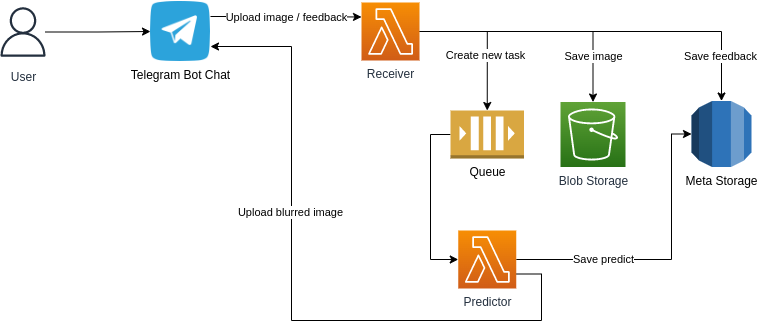

# Project "Photo Anonymization"

Telegram bot "Photo Anonymization". You upload a photo, the faces are programmatically blured.

## Authors

- [Mark Andreev](https://github.com/mrk-andreev)
- [Yuliya Fokina](https://github.com/foookinaaa)
